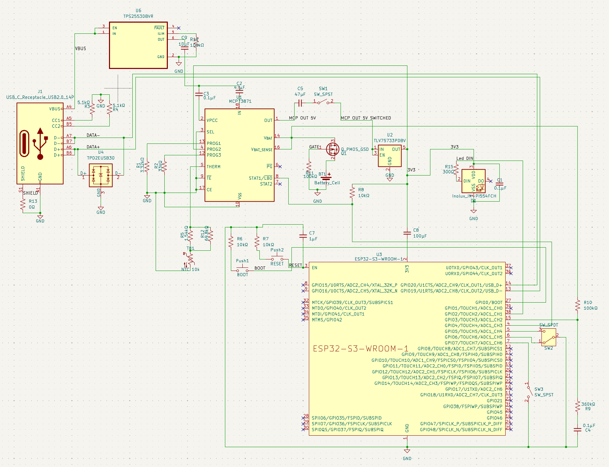
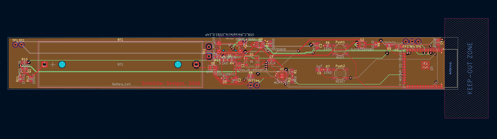
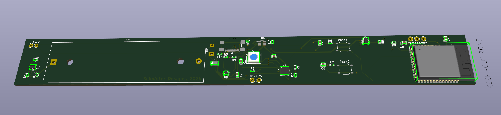

# ESP32 Pedal PCB Design

KiCad project for a custom ESP32-based pedal PCB.

## Images


*Complete schematic diagram*


*PCB layout and routing*


*3D visualization of the PCB*


*Reference: FireBeetle 2 ESP32-E board (for comparison)*

## Specifications

- **Board Size**: 215.9mm x 25.4mm (8.5" x 1")
- **MCU**: ESP32-S3-WROOM-1 (native USB support)
- **Power**: USB-C charging + LiPo battery
- **Features**:
  - USB-C port (charging + data/programming)
  - Battery charging with TP4056
  - Battery voltage monitoring (ADC)
  - Status LED (green)
  - RGB LED (charger status, user-controllable)
  - Auto-reset circuit
  - Battery protection

## Circuit Sections

### 1. Power Management
- **USB-C Input**: VBUS with 5.1kΩ CC pull-downs
- **Battery Charger**: TP4056 (500mA charging current)
- **Battery Protection**: DW01A + FS8205A MOSFETs
- **3.3V Regulator**: AMS1117-3.3 or AP2112K-3.3
- **Battery Monitor**: Voltage divider (2x 100kΩ) to GPIO34

### 2. ESP32-S3-WROOM-1
- Native USB support (no USB-UART bridge needed)
- USB D+/D- connected directly to ESP32-S3
- Auto-reset circuit (DTR/RTS control)
- Boot button (GPIO0)
- Reset button (EN)

### 3. LEDs
- **Green Status LED**: GPIO2 → 330Ω → LED → GND
- **RGB LED**: 
  - Red: GPIO16 → 330Ω → R pin
  - Green: GPIO17 → 330Ω → G pin
  - Blue: GPIO18 → 330Ω → B pin
  - Common cathode → GND

### 4. Battery Monitoring
- Battery voltage divider: VBAT → 100kΩ → GPIO34 → 100kΩ → GND
- Charger status: TP4056 STAT pin → GPIO35

## GPIO Assignments

```
GPIO0:  Boot button (pulled high, button to GND)
GPIO2:  Green status LED
GPIO16: RGB LED - Red
GPIO17: RGB LED - Green  
GPIO18: RGB LED - Blue
GPIO21: Pedal switch
GPIO34: Battery voltage (ADC, input only)
GPIO35: Charger status (ADC, input only)
EN:     Reset button (pulled high, button to GND)
```

## Components List (BOM)

### ICs
- U1: ESP32-S3-WROOM-1 (or WROOM-1-N4R8)
- U2: TP4056 (battery charger)
- U3: AMS1117-3.3 or AP2112K-3.3 (3.3V regulator)
- U4: DW01A (battery protection)
- Q1, Q2: FS8205A (dual MOSFET for protection)

### Connectors
- J1: USB-C receptacle (16-pin or 24-pin)
- J2: JST-PH 2-pin (battery connector)

### LEDs
- D1: Green LED (3mm or 0805 SMD)
- D2: RGB LED common cathode (5mm or SMD)

### Resistors (0805 SMD or through-hole)
- R1: 330Ω (green LED)
- R2, R3, R4: 330Ω (RGB LED)
- R5, R6: 100kΩ (battery voltage divider)
- R7, R8: 5.1kΩ (USB-C CC pull-down)
- R9: 10kΩ (EN pull-up)
- R10: 2kΩ (TP4056 charging current - 500mA)
- R11, R12: 10kΩ (GPIO0 pull-up, optional)

### Capacitors (0805 SMD or through-hole)
- C1, C2: 10µF (USB input filtering)
- C3, C4: 10µF (3.3V regulator output)
- C5-C10: 100nF (decoupling for ESP32, ICs)
- C11: 100nF (EN reset filter)

### Buttons
- SW1: Tactile switch (reset)
- SW2: Tactile switch (boot/GPIO0)

### Battery
- 1S LiPo (3.7V nominal, 4.2V max)
- Capacity: 500mAh - 2000mAh (your choice)

## PCB Layout Notes

Given the 215.9mm x 25.4mm constraint:
- **2-layer PCB** recommended (cost-effective)
- **Component placement**:
  - USB-C connector at one end
  - Battery connector at opposite end
  - ESP32 module in center
  - LEDs near ESP32 for visibility
  - Charging IC near USB-C
  - Regulator between battery and ESP32
- **Ground plane** on bottom layer (Layer 2)
- **Power traces** on top layer (Layer 1)
- **USB differential pairs**: Keep D+/D- traces matched length, ~90Ω impedance
- **Mounting holes**: 4x M3 holes at corners (optional)

## Design Status

✅ **COMPLETE** - Schematic and PCB layout are complete. See images above for visual reference.

## Notes

- KiCad 7.0 or later required
- Custom Espressif symbol and footprint libraries included in this directory
- Design files are tracked in git (temporary files excluded via `.gitignore`)

## Design Files

All design files are included in this directory:
- `esp32-pedal-pcb.kicad_pro` - KiCad project file
- `esp32-pedal-pcb.kicad_sch` - Schematic
- `esp32-pedal-pcb.kicad_pcb` - PCB layout
- `esp32-pedal-pcb.kicad_dru` - Design rules
- `esp32-pedal-pcb.rules` - Custom design rules

## TODO

- [x] Complete schematic
- [x] Create PCB layout
- [x] Design rule check (DRC)
- [ ] Generate Gerber files
- [ ] Create assembly drawings
- [ ] Generate BOM

